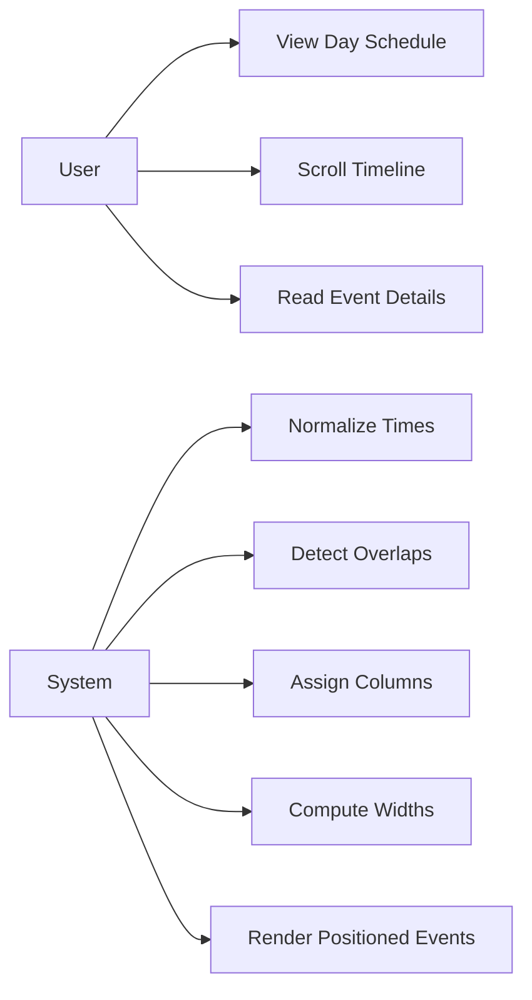
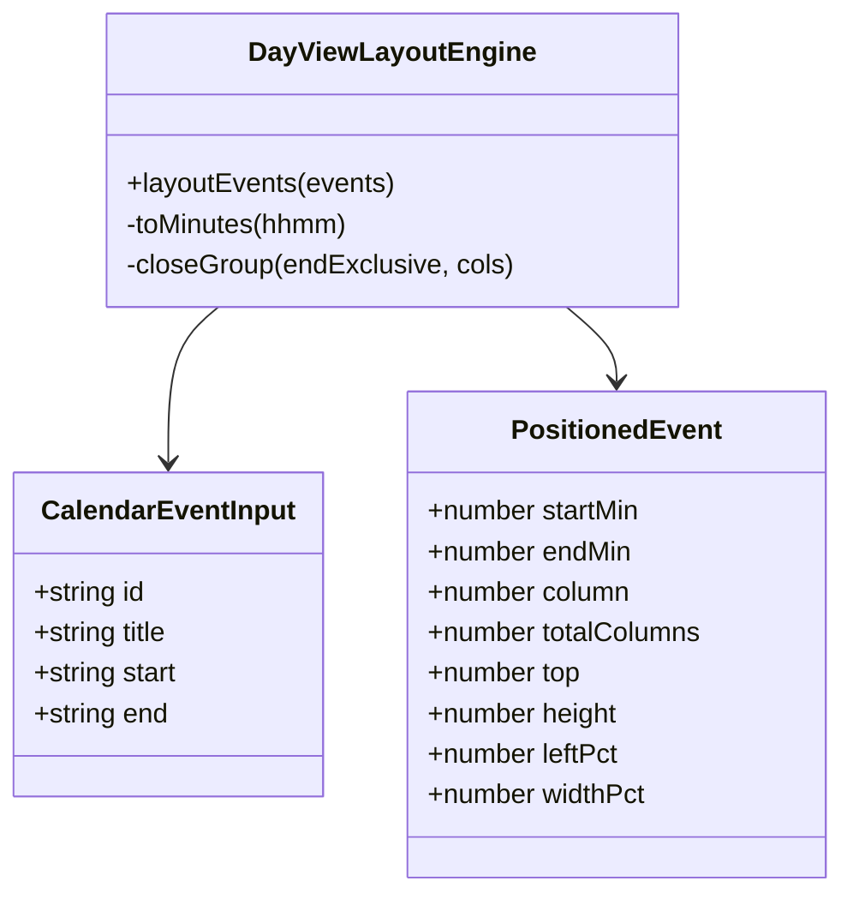
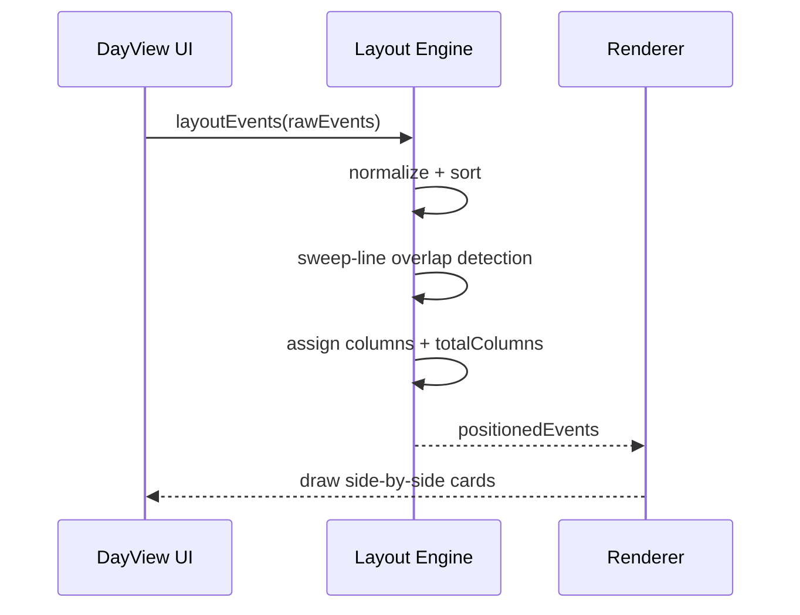
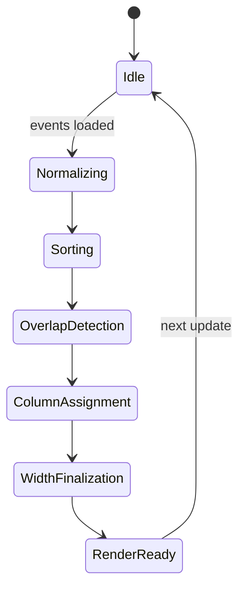
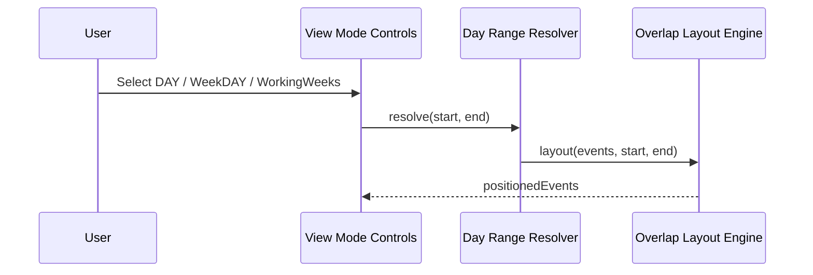
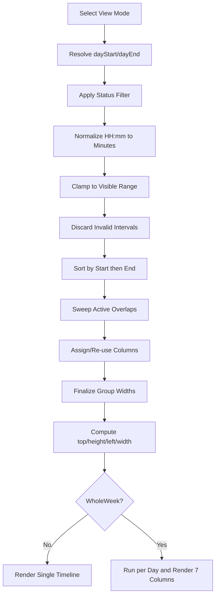
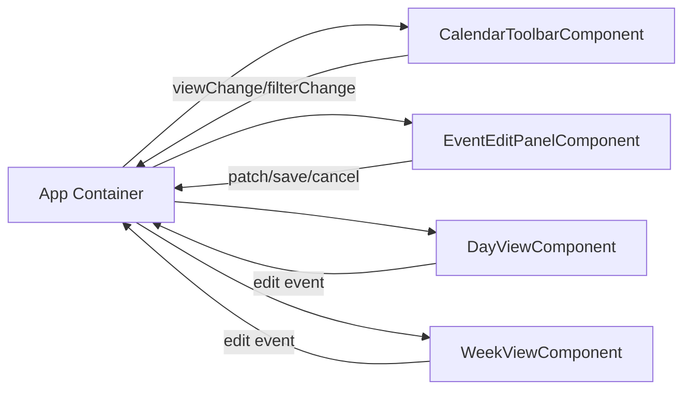

# UML Diagrams

## Use Case Diagram

## Class Diagram

## Sequence Diagram

## State Diagram

## Additional View Mode Sequence

## Full Implementation Activity Flow

## Component Interaction Diagram

