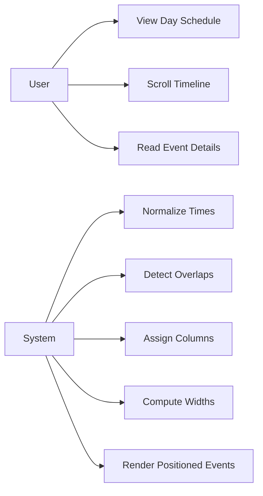
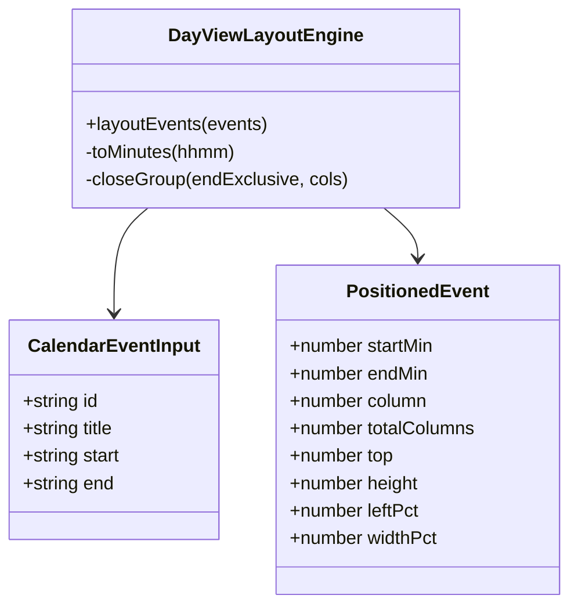
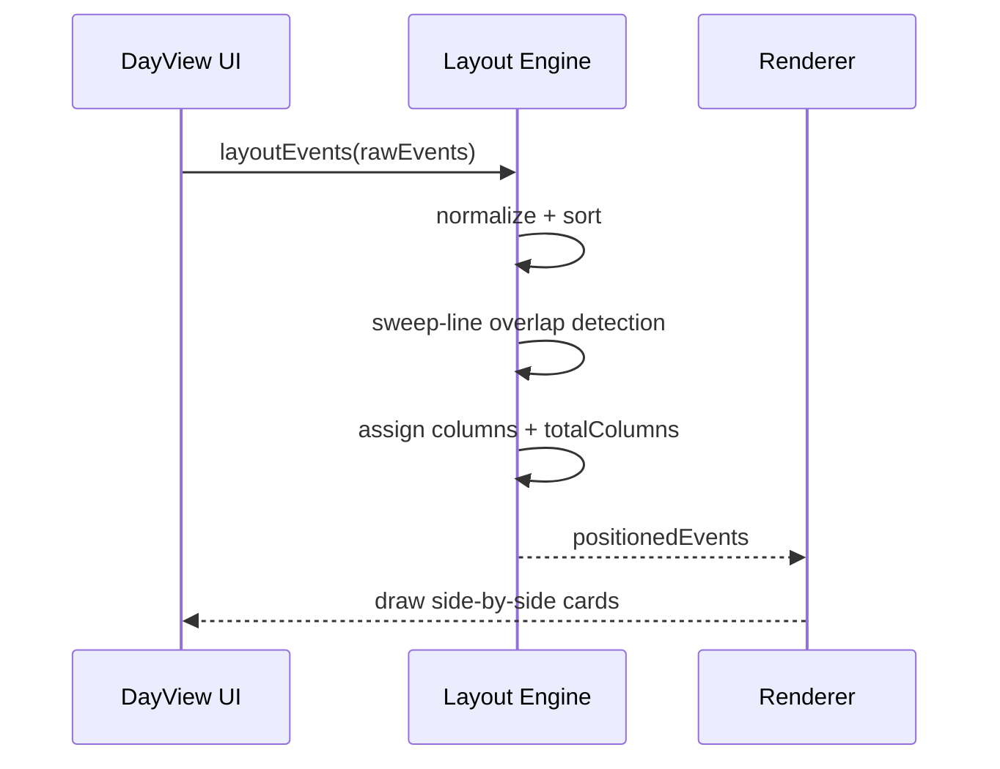
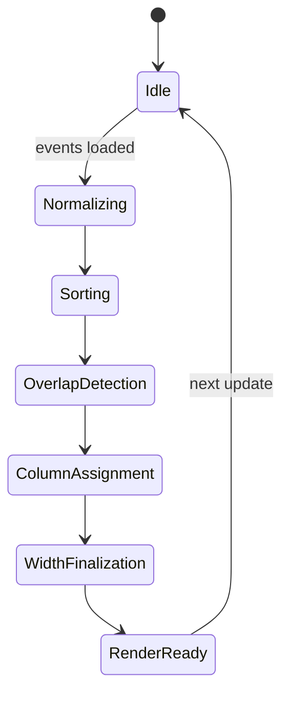

# UML Diagrams

## Use Case Diagram

```mermaid
flowchart LR
  U[User] --> V[View Day Schedule]
  U --> S[Scroll Timeline]
  U --> R[Read Event Details]

  A[System] --> N[Normalize Times]
  A --> O[Detect Overlaps]
  A --> C[Assign Columns]
  A --> W[Compute Widths]
  A --> P[Render Positioned Events]
```

## Class Diagram

```mermaid
classDiagram
  class CalendarEventInput {
    +string id
    +string title
    +string start
    +string end
  }

  class PositionedEvent {
    +number startMin
    +number endMin
    +number column
    +number totalColumns
    +number top
    +number height
    +number leftPct
    +number widthPct
  }

  class DayViewLayoutEngine {
    +layoutEvents(events)
    -toMinutes(hhmm)
    -closeGroup(endExclusive, cols)
  }

  DayViewLayoutEngine --> CalendarEventInput
  DayViewLayoutEngine --> PositionedEvent
```

## Sequence Diagram

```mermaid
sequenceDiagram
  participant UI as DayView UI
  participant Engine as Layout Engine
  participant Render as Renderer

  UI->>Engine: layoutEvents(rawEvents)
  Engine->>Engine: normalize + sort
  Engine->>Engine: sweep-line overlap detection
  Engine->>Engine: assign columns + totalColumns
  Engine-->>Render: positionedEvents
  Render-->>UI: draw side-by-side cards
```

## State Diagram

```mermaid
stateDiagram-v2
  [*] --> Idle
  Idle --> Normalizing: events loaded
  Normalizing --> Sorting
  Sorting --> OverlapDetection
  OverlapDetection --> ColumnAssignment
  ColumnAssignment --> WidthFinalization
  WidthFinalization --> RenderReady
  RenderReady --> Idle: next update
```
